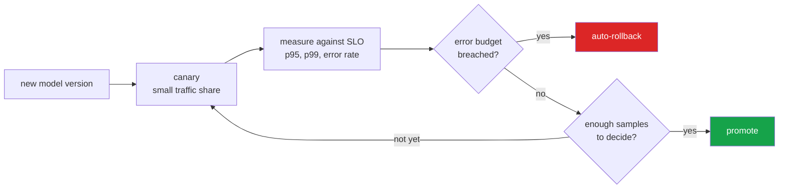

<h1 align="center">model-serving-platform (Python · A/B + canary + shadow · SLO monitor)</h1>
<p align="center"><i>The deployment logic - canaries, SLOs and auto-rollback - built and tested properly</i></p>

<p align="center">
  <a href="#what-it-does">What it does</a> &middot;
  <a href="#six-decisions-worth-defending">Six decisions</a> &middot;
  <a href="#percentiles-not-averages">Percentiles</a> &middot;
  <a href="#usage">Usage</a> &middot;
  <a href="#limits">Limits</a> &middot;
  <a href="#problems-hit-while-building-this">Problems hit</a>
</p>

<p align="center">
  <a href="https://github.com/hammasbuilds/model-serving-platform/actions/workflows/ci.yml"></a>
  
  
  
  <a href="LICENSE"></a>
</p>

---

## What it does



The "not yet" branch is the one most implementations miss: **a healthy verdict and no
verdict yet are not the same thing**, and promoting on the second is how a bad version
reaches everyone.


| | |
|---|---|
| **Registry** | Versions with lifecycle stages. At most one champion per model — enforced, not documented. |
| **Canary** | A slice of traffic to a challenger, with sticky assignment. |
| **Shadow** | A version scores real traffic while its output is discarded. |
| **SLOs** | Per-version p50/p95/p99 and error rate, compared champion against challenger. |
| **Auto-rollback** | A breaching canary removes itself. |

## Six decisions worth defending

**Traffic assignment is a hash, not a coin flip.** Random assignment means the same
user sees the champion and then the challenger within one session — an inconsistent
experience and an A/B result that measures nothing. Hashing makes assignment sticky
and reproducible, so a split can be replayed exactly during an investigation. A salt
keeps two experiments on the same user uncorrelated, because a user who is unlucky in
one should not be systematically unlucky in every one.

**Promotion is atomic.** The outgoing champion is demoted in the same operation that
promotes the incoming one. A registry that can briefly have two champions, or none,
will eventually do exactly that under load.

**A shadow failure cannot reach the caller.** Shadows score the same request, their
output is recorded and never returned, and their exceptions are contained. If a shadow
error could surface to a user, nobody would dare shadow anything worth testing.

**No SLO verdict below a sample floor.** One slow request in the first three must not
roll back a healthy deployment. A canary system that cries wolf gets switched off,
which is worse than not having one.

**Comparison is relative, not absolute.** A challenger at 3% errors is fine against a
champion at 4%, and a disaster against a champion at 0.1%. A fixed threshold cannot
tell those apart.

**A shared outage does not trigger rollback.** If the champion is breaching too, the
problem is upstream. Rolling back then removes a healthy deployment and fixes nothing.
This is a test:

```python
def test_a_shared_outage_does_not_roll_back_the_canary():
    ...
    assert p.registry.challenger("risk") is not None
    assert not p.rollbacks
```

## Percentiles, not averages

The mean is the one latency statistic that never matters — users live at p95 and p99,
and you cannot recover a percentile from an average. Percentiles use nearest-rank:
unambiguous, and correct on small samples where interpolation invents a value no
request actually had.

## Usage

```python
platform = ServingPlatform()
platform.registry.register("risk", 1)
platform.registry.register("risk", 2)
platform.load("risk", 1, champion_model)
platform.load("risk", 2, new_model)

platform.registry.promote("risk", 1)             # v1 serves everything
platform.registry.start_canary("risk", 2, 0.05)  # 5% to v2
platform.registry.add_shadow("risk", 3)          # v3 scores, nobody sees it

result = platform.predict("risk", features, request_key=user_id)
result.version          # 1 or 2, stable for this user
result.shadow           # v3's output and whether it agreed
platform.status("risk") # champion vs challenger, side by side
```

A breaching canary rolls itself back. `platform.rollbacks` records why.

## Tests

**32 tests, no models, no GPU, no training.**

Models are fakes — a function that returns a value, fails, or is slow. Everything worth
testing here is a *routing and lifecycle* behaviour, not a modelling one, which is why
the whole platform can be verified in milliseconds.

```bash
make test
```

| Covered | |
|---|---|
| Registry | champion uniqueness, idempotent promotion, one canary at a time, rollback semantics, audit history |
| Splitting | stickiness, distribution accuracy, salt decorrelation, boundaries |
| Serving | routing, missing champion, unloaded model, model failure |
| Shadow | output discarded, failure contained, agreement reporting |
| SLO | sample floor, latency breach, error breach, percentiles, relative comparison |
| Rollback | bad canary rolls back, healthy canary survives, shared outage does not |

## Layout

```
src/serving/
  types.py             ModelVersion, Stage, Prediction
  registry/store.py    lifecycle, promotion, canary, rollback, history
  routing/split.py     hash-based sticky assignment
  observe/slo.py       per-version percentiles and the rollback decision
  server.py            predict: route, score, shadow, measure, maybe roll back
tests/                 fake models that fail and stall on demand
```

## Limits

- In-process. Multi-instance deployment needs shared state for the registry and the
  SLO window — Redis or Postgres is the obvious next step.
- Rollback is automatic; roll-*forward* promotion is deliberately manual. Promoting on
  a metric alone is how a model that looks good for an hour reaches everyone.
- No model loading or serialisation. The platform takes callables; what produces them
  is the training pipeline's problem.

## Keywords

model serving &middot; MLOps &middot; canary deployment &middot; progressive rollout &middot; auto-rollback &middot; SLO &middot; error budget &middot; p95 &middot; p99 &middot; percentiles &middot; A/B testing &middot; champion challenger &middot; shadow deployment &middot; model registry &middot; production ML &middot; zero dependencies

## License

MIT

---

## Run it yourself

```bash
git clone https://github.com/hammasbuilds/model-serving-platform
cd model-serving-platform

uv sync --all-groups     # or: pip install -e ".[dev]"
make test                # 32 tests, no models, no GPU, no training
```

Models are just callables, so you can wire in anything — sklearn, a torch module, a
remote endpoint:

```python
from serving import ServingPlatform

platform = ServingPlatform()
platform.registry.register("risk", 1); platform.load("risk", 1, champion_model)
platform.registry.register("risk", 2); platform.load("risk", 2, new_model)

platform.registry.promote("risk", 1)              # v1 serves everything
platform.registry.start_canary("risk", 2, 0.05)   # 5% to v2, sticky per user
platform.registry.add_shadow("risk", 3)           # v3 scores, nobody sees it

result = platform.predict("risk", features, request_key=user_id)
platform.status("risk")     # champion vs challenger, side by side
platform.rollbacks          # why anything was rolled back
```

### Input / Output


`python demo.py`


The challenger's numbers are identical in both scenarios: 100% error rate, far past the
2% SLO. The decisions are opposite.

Rolling back scenario B would archive the challenger, restore a champion that is failing
every request just as hard, and report the incident as handled. The rollback that does
not happen is the harder one to get right, and the one nothing would have alerted on.

## Problems hit while building this

**Ranking canary assignment randomly looked fine and was not.** A coin flip per request
means the same user hits the champion, then the challenger, then the champion again
within one session — an inconsistent experience *and* an A/B result that measures
nothing. *Fixed* by hashing the request identity, so assignment is sticky and the split
can be replayed exactly during an investigation. A salt keeps two experiments on the
same user uncorrelated.

**Promotion could briefly leave two champions, or none.** Demoting the old champion and
promoting the new one as separate steps is a race that will eventually happen under
load, and a registry in that state serves whichever version it reaches first. *Fixed* by
making promotion atomic, with a test asserting exactly one champion after repeated
promotions.

**The first auto-rollback rule would have rolled back during an outage.** If an upstream
dependency fails, the challenger breaches its SLO — but so does the champion. Rolling
back then removes a healthy deployment and fixes nothing, while the real problem
continues. *Fixed* by checking the champion too, and that shared-outage case is a test.

**…and that fix was still wrong, which the test could not see.** Building the dashboard
above and clicking "upstream outage" rolled the canary back anyway. The cause:

```python
def breached(self, key):
    """Return the reason for a breach, or None. Silent below min_samples."""
```

`None` means **either** "healthy" **or** "no verdict yet", and the outage guard read the
second as the first. The challenger can cross `min_samples` first — bucketing is a hash,
not an even split — and at that moment the champion is failing every request while still
having nothing to say about it, so the outage looks exactly like a bad canary:

```
rollback fired at request 31
  champion   v1  requests=12  breached=None          <- silent, not healthy
  challenger v2  requests=20  breached=error rate 100.00%
```

**The existing test passed only because of how its request keys hashed.** At 50% canary,
`u{i}` keys put the champion over `min_samples` first (request 29 vs 57) and the guard
worked; `req-{i}` keys put the challenger first (31 vs 46) and it did not. The assertion
was right and the fixture happened to avoid the failing path.

*Fixed* by deferring the rollback decision until the champion has a verdict at all, with
a second test using the key prefix that buckets the other way — verified to fail against
the old logic, so the ordering cannot quietly come back.
