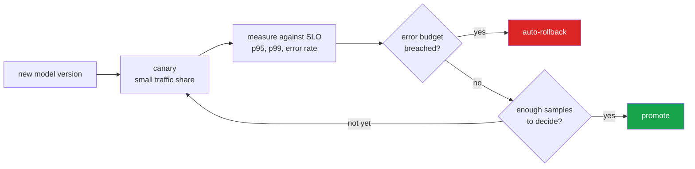

<h1 align="center">model-serving-platform (Python · A/B + canary + shadow · SLO monitor)</h1>
<p align="center"><i>The deployment logic - canaries, SLOs and auto-rollback - built and tested properly</i></p>

<p align="center">
  <a href="#what-it-does">What it does</a> &middot;
  <a href="#six-decisions-worth-defending">Six decisions</a> &middot;
  <a href="#percentiles-not-averages">Percentiles</a> &middot;
  <a href="#usage">Usage</a> &middot;
  <a href="#limits">Limits</a> 
</p>

<p align="center">
  <a href="https://github.com/hammasbuilds/model-serving-platform/actions/workflows/ci.yml"></a>
  
  
  
  <a href="LICENSE"></a>
</p>

---

## What it does

An **in-process Python library**, not a network server: there is no HTTP endpoint or CLI.
You call `ServingPlatform.predict()` from your own process (or wrap it in your own
FastAPI/Flask handler). It owns the deployment logic - registry, canary, shadow, SLOs
and auto-rollback - and takes any Python callable as a model.


```mermaid
flowchart LR
    D["new model version"] --> C["canary<br/>small traffic share"]
    C --> M["measure against SLO<br/>p95, p99, error rate"]
    M --> E{"error budget<br/>breached?"}
    E -->|"yes"| RB["auto-rollback"]
    E -->|"no"| S{"enough samples<br/>to decide?"}
    S -->|"not yet"| C
    S -->|"yes"| P["promote"]

    style RB fill:#dc2626,color:#fff
    style P fill:#16a34a,color:#fff
```

The "not yet" branch is the one most implementations miss: **a healthy verdict and no
verdict yet are not the same thing**, and promoting on the second is how a bad version
reaches everyone.


| | |
|---|---|
| **Registry** | Versions with lifecycle stages. At most one champion per model — enforced, not documented. |
| **Canary** | A slice of traffic to a challenger, with sticky assignment. |
| **Shadow** | A version scores real traffic while its output is discarded. |
| **SLOs** | Per-version p50/p95/p99 and error rate, compared champion against challenger. |
| **Auto-rollback** | A breaching canary removes itself. |

## Six decisions worth defending

**Traffic assignment is a hash, not a coin flip.** Random assignment means the same
user sees the champion and then the challenger within one session — an inconsistent
experience and an A/B result that measures nothing. Hashing makes assignment sticky
and reproducible, so a split can be replayed exactly during an investigation. A salt
keeps two experiments on the same user uncorrelated, because a user who is unlucky in
one should not be systematically unlucky in every one.

**Promotion is atomic.** The outgoing champion is demoted in the same operation that
promotes the incoming one. A registry that can briefly have two champions, or none,
will eventually do exactly that under load.

**A shadow failure cannot reach the caller.** Shadows score the same request, their
output is recorded and never returned, and their exceptions are contained. If a shadow
error could surface to a user, nobody would dare shadow anything worth testing.

**No SLO verdict below a sample floor.** One slow request in the first three must not
roll back a healthy deployment. A canary system that cries wolf gets switched off,
which is worse than not having one.

**Comparison is relative, not absolute.** A challenger at 3% errors is fine against a
champion at 4%, and a disaster against a champion at 0.1%. A fixed threshold cannot
tell those apart.

**A shared outage does not trigger rollback.** If the champion is breaching too, the
problem is upstream. Rolling back then removes a healthy deployment and fixes nothing.
This is a test:

```python
from serving import SLO, ServingPlatform, SLOMonitor

def broken(features):
    raise RuntimeError("upstream feature store timeout")

p = ServingPlatform(monitor=SLOMonitor(slo=SLO(max_error_rate=0.05, min_samples=20)))
for v in (1, 2):
    p.registry.register("risk", v)
    p.load("risk", v, broken)          # both versions fail: a shared outage
p.registry.promote("risk", 1)
p.registry.start_canary("risk", 2, 0.5)
for i in range(300):
    try:
        p.predict("risk", {}, request_key=f"u{i}")
    except RuntimeError:
        pass                           # a failing model is recorded, then re-raised

assert p.registry.challenger("risk") is not None   # canary still running
assert not p.rollbacks                             # nothing was rolled back
```

The same check lives in `tests/test_serving.py` as
`test_a_shared_outage_does_not_roll_back_the_canary`.

## Percentiles, not averages

The mean is the one latency statistic that never matters — users live at p95 and p99,
and you cannot recover a percentile from an average. Percentiles use nearest-rank:
unambiguous, and correct on small samples where interpolation invents a value no
request actually had.

## Usage

```python
from serving import ServingPlatform

def champion_model(features):   # any callable: sklearn .predict, a torch module, an HTTP client
    return 0.10

def new_model(features):
    return 0.12

def shadow_model(features):
    return 0.11

features = {"income": 52_000, "age": 41}
user_id = "user-42"

platform = ServingPlatform()
for version, model in ((1, champion_model), (2, new_model), (3, shadow_model)):
    platform.registry.register("risk", version)
    platform.load("risk", version, model)

platform.registry.promote("risk", 1)             # v1 serves everything
platform.registry.start_canary("risk", 2, 0.05)  # 5% to v2
platform.registry.add_shadow("risk", 3)          # v3 scores, nobody sees it

result = platform.predict("risk", features, request_key=user_id)
print(result.version)          # 1 or 2, stable for this user
print(result.shadow)           # v3's output and whether it agreed
print(platform.status("risk")) # champion vs challenger, side by side
```

A breaching canary rolls itself back. `platform.rollbacks` records why.

## Tests

**44 tests, no models, no GPU, no training.**

Models are fakes — a function that returns a value, fails, or is slow. Everything worth
testing here is a *routing and lifecycle* behaviour, not a modelling one, which is why
the whole platform can be verified in milliseconds.

```bash
uv run pytest -q      # or, once deps are installed: pytest -q
make test              # shortcut for the same command, if you have `make`
```

| Covered | |
|---|---|
| Registry | champion uniqueness, idempotent promotion, one canary at a time, rollback semantics, audit history, shadow cannot steal champion/challenger |
| Splitting | stickiness, distribution accuracy, salt decorrelation, boundaries |
| Serving | routing, missing champion, unloaded model, model failure, empty-string request key stays sticky |
| Shadow | output discarded, failure contained, agreement reporting |
| Public API | every README python block runs verbatim, `from serving import ServingPlatform` (the quickstart import), `pip install -e ".[dev]"` installs pytest |
| SLO | sample floor, latency breach, error breach, percentiles, relative comparison |
| Rollback | bad canary rolls back, healthy canary survives, shared outage does not |

## Layout

```
src/serving/
  types.py             ModelVersion, Stage, Prediction
  registry/store.py    lifecycle, promotion, canary, rollback, history
  routing/split.py     hash-based sticky assignment
  observe/slo.py       per-version percentiles and the rollback decision
  server.py            predict: route, score, shadow, measure, maybe roll back
tests/                 fake models that fail and stall on demand
```

## Limits

- In-process. Multi-instance deployment needs shared state for the registry and the
  SLO window — Redis or Postgres is the obvious next step.
- Rollback is automatic; roll-*forward* promotion is deliberately manual. Promoting on
  a metric alone is how a model that looks good for an hour reaches everyone.
- No model loading or serialisation. The platform takes callables; what produces them
  is the training pipeline's problem.

## Keywords

model serving &middot; MLOps &middot; canary deployment &middot; progressive rollout &middot; auto-rollback &middot; SLO &middot; error budget &middot; p95 &middot; p99 &middot; percentiles &middot; A/B testing &middot; champion challenger &middot; shadow deployment &middot; model registry &middot; production ML &middot; zero dependencies

## License

MIT

---

## Run it yourself

```bash
git clone https://github.com/hammasbuilds/model-serving-platform
cd model-serving-platform

uv sync --all-groups                # or, without uv: pip install -e ".[dev]"
uv run pytest -q                    # 44 tests, no models, no GPU, no training
# make test                         # shortcut for the line above, if you have `make`
# (make is not installed by default on Windows; the pytest command above needs no make)
```

Models are just callables, so you can wire in anything — sklearn, a torch module, a
remote endpoint:

```python
from serving import ServingPlatform

def champion_model(features):   # any callable: sklearn .predict, a torch module, an HTTP client
    return 0.10

def new_model(features):
    return 0.12

def shadow_model(features):
    return 0.11

features = {"income": 52_000, "age": 41}
user_id = "user-42"

platform = ServingPlatform()
platform.registry.register("risk", 1); platform.load("risk", 1, champion_model)
platform.registry.register("risk", 2); platform.load("risk", 2, new_model)
platform.registry.register("risk", 3); platform.load("risk", 3, shadow_model)

platform.registry.promote("risk", 1)              # v1 serves everything
platform.registry.start_canary("risk", 2, 0.05)   # 5% to v2, sticky per user
platform.registry.add_shadow("risk", 3)           # v3 scores, nobody sees it

result = platform.predict("risk", features, request_key=user_id)
print(platform.status("risk"))  # champion vs challenger, side by side
print(platform.rollbacks)       # why anything was rolled back
```

### Input / Output

`python demo.py` (output pasted from a real run):

```text
INPUT
   champion v1 and challenger v2, 50/50 canary split, SLO max_error_rate=2%
   scenario A  challenger broken, champion healthy
   scenario B  shared upstream down, both broken
   2000 requests sent through each

OUTPUT
   scenario A  challenger broken, champion healthy
      champion now       v1
      rollbacks fired    1
      reason             error rate 100.00% exceeds 2.00%

   scenario B  shared upstream down, both broken
      champion now       v1
      rollbacks fired    0
      held               both versions breach; rolling back would
                         remove a deployment that is no better or worse

   The difference is not in the challenger's numbers. They are equally
   bad in both scenarios. It is in whether the champion is a way out.
```

The challenger's numbers are identical in both scenarios: 100% error rate, far past the
2% SLO. The decisions are opposite.

Rolling back scenario B would archive the challenger, restore a champion that is failing
every request just as hard, and report the incident as handled. The rollback that does
not happen is the harder one to get right, and the one nothing would have alerted on.
